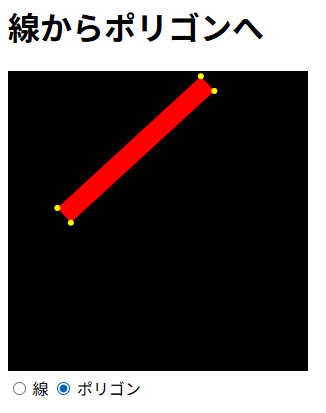

# line_to_polygon

## 概要

JavaScriptでポリゴンを使って線を描きます。

かなり太い線のときは、ポリゴンを使った方が速いことがあります。



## コード

```js
/**
 * 2点間に幅を持った線（矩形ポリゴン）を描画する。
 * これは、Canvasの標準的な ctx.stroke() による描画ではなく、
 * 線の幅に基づいて計算された4つの頂点を持つ多角形を ctx.fill() で塗りつぶす手法。
 * * @param {CanvasRenderingContext2D} ctx - 描画に使用するCanvas 2Dコンテキスト。lineWidth, strokeStyleが適用される。
 * @param {number} x0 - 始点 (P0) のX座標。
 * @param {number} y0 - 始点 (P0) のY座標。
 * @param {number} x1 - 終点 (P1) のX座標。
 * @param {number} y1 - 終点 (P1) のY座標。
 * @param {boolean} [debugging=false] - trueの場合、計算された4つの頂点を黄色の点で描画する。
 */
const drawLineByPolygon = (ctx, x0, y0, x1, y1, debugging = false) => {
    const lineWidth = ctx.lineWidth;
    const halfWidth = lineWidth / 2;
    // 1. 方向ベクトルの計算
    const dx = x1 - x0, dy = y1 - y0;
    // 2. 法線ベクトルの計算 (時計回りに90度回転)
    const nx = dy, ny = -dx;
    // 法線ベクトルを正規化（長さ1にする）
    const len = Math.sqrt(nx * nx + ny * ny);
    const normX = nx / len, normY = ny / len;
    // 3. 矩形の4つの頂点を計算
    // 始点P1から法線方向に +/- halfWidth オフセット
    const p0x = x0 + normX * halfWidth;
    const p0y = y0 + normY * halfWidth;
    const p1x = x0 - normX * halfWidth;
    const p1y = y0 - normY * halfWidth;
    // 終点P2から法線方向に +/- halfWidth オフセット
    const p2x = x1 - normX * halfWidth;
    const p2y = y1 - normY * halfWidth;
    const p3x = x1 + normX * halfWidth;
    const p3y = y1 + normY * halfWidth;
    // 4. 矩形の塗りつぶし
    // 頂点を結んで多角形を作成
    ctx.beginPath();
    ctx.moveTo(p0x, p0y);
    ctx.lineTo(p1x, p1y);
    ctx.lineTo(p2x, p2y);
    ctx.lineTo(p3x, p3y);
    ctx.closePath();
    ctx.fillStyle = ctx.strokeStyle;
    ctx.fill();

    if (debugging) {
        // 黄色い頂点を描く(デバッグ用)
        ctx.fillStyle = "yellow";
        let radius = 3;
        ctx.beginPath();
        ctx.arc(p0x, p0y, radius, 0, 2 * Math.PI, false);
        ctx.fill();
        ctx.beginPath();
        ctx.arc(p1x, p1y, radius, 0, 2 * Math.PI, false);
        ctx.fill();
        ctx.beginPath();
        ctx.arc(p2x, p2y, radius, 0, 2 * Math.PI, false);
        ctx.fill();
        ctx.beginPath();
        ctx.arc(p3x, p3y, radius, 0, 2 * Math.PI, false);
        ctx.fill();
    }
};
```
